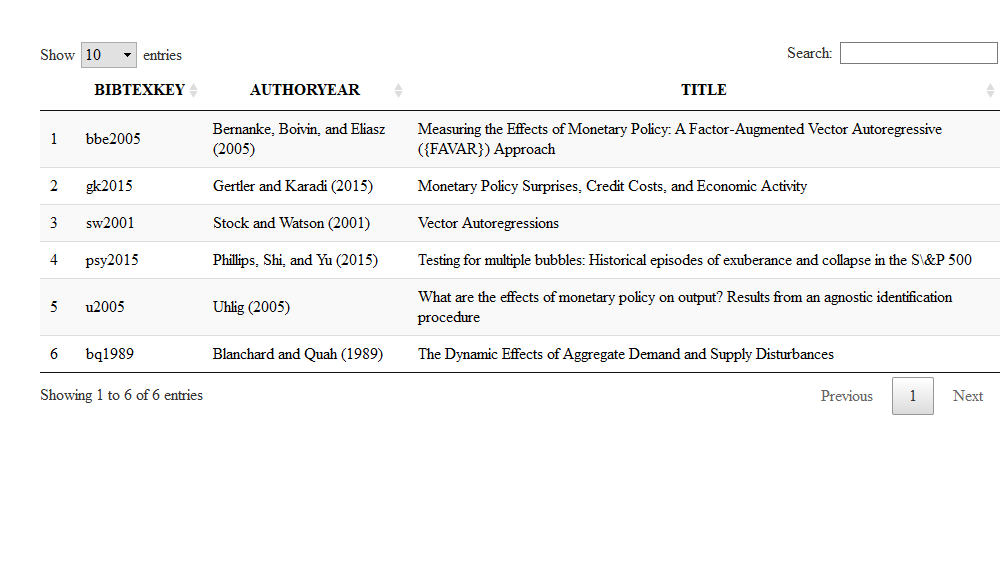

<!-- README.md is generated from README.Rmd. Please edit that file -->

# econdata

<!-- badges: start -->

<!-- badges: end -->

In Economics authors have collected their own research data or used
external datasets. The goal of {econodata} is to provide a curated list
of datasets that are used in the most influential economic papers.

## Installation

``` r
# install.packages("devtools")
devtools::install_github("kvasilopoulos/econdata")
```

# Usage

All data are stored as objects in unquoted name format.

``` r
library(econdata)

# Stock and Watson (2001) dataset
sw2001
#>           date       infl        un        ff
#> 1   1960-01-01  0.9084719  5.133333  3.933333
#> 2   1960-04-01  1.8107772  5.233333  3.696667
#> 3   1960-07-01  1.6227203  5.533333  2.936667
#> 4   1960-10-01  1.7953352  6.266667  2.296667
#> 5   1961-01-01  0.5370330  6.800000  2.003333
#> 6   1961-04-01  0.7149242  7.000000  1.733333
#> 7   1961-07-01  0.8918621  6.766667  1.683333
#> 8   1961-10-01  1.0676163  6.200000  2.400000
#> 9   1962-01-01  2.3034394  5.633333  2.456667
#> 10  1962-04-01  1.2348411  5.533333  2.606667
#> 11  1962-07-01  1.0554096  5.566667  2.846667
#> 12  1962-10-01  1.2278019  5.533333  2.923333
#> 13  1963-01-01  1.5730848  5.766667  2.966667
#> 14  1963-04-01  0.3487359  5.733333  2.963333
#> 15  1963-07-01  0.5225344  5.500000  3.330000
#> 16  1963-10-01  2.4295086  5.566667  3.453333
#> 17  1964-01-01  1.3816939  5.466667  3.463333
#> 18  1964-04-01  1.2050795  5.200000  3.490000
#> 19  1964-07-01  2.0574413  5.000000  3.456667
#> 20  1964-10-01  1.7064872  4.966667  3.576667
#> 21  1965-01-01  1.8687653  4.900000  3.973333
#> 22  1965-04-01  1.8600752  4.666667  4.076667
#> 23  1965-07-01  1.6835042  4.366667  4.073333
#> 24  1965-10-01  2.6789552  4.100000  4.166667
#> 25  1966-01-01  2.3294575  3.866667  4.556667
#> 26  1966-04-01  3.6333858  3.833333  4.913333
#> 27  1966-07-01  3.9264119  3.766667  5.410000
#> 28  1966-10-01  3.5656638  3.700000  5.563333
#> 29  1967-01-01  1.7709830  3.833333  4.823333
#> 30  1967-04-01  2.5620584  3.833333  3.990000
#> 31  1967-07-01  3.6544445  3.800000  3.893333
#> 32  1967-10-01  4.4042914  3.900000  4.173333
#> 33  1968-01-01  4.5110336  3.733333  4.786667
#> 34  1968-04-01  4.4607269  3.566667  5.980000
#> 35  1968-07-01  3.6543840  3.533333  5.943333
#> 36  1968-10-01  5.5692339  3.400000  5.916667
#> 37  1969-01-01  3.8676389  3.400000  6.566667
#> 38  1969-04-01  5.4402603  3.433333  8.326667
#> 39  1969-07-01  5.7993042  3.566667  8.983333
#> 40  1969-10-01  5.1484443  3.566667  8.940000
#> 41  1970-01-01  5.5037030  4.166667  8.573333
#> 42  1970-04-01  5.5672437  4.766667  7.880000
#> 43  1970-07-01  3.1664251  5.166667  6.703333
#> 44  1970-10-01  5.1771840  5.833333  5.566667
#> 45  1971-01-01  6.0454551  5.933333  3.856667
#> 46  1971-04-01  5.2980907  5.900000  4.563333
#> 47  1971-07-01  4.0582904  6.033333  5.473333
#> 48  1971-10-01  3.2430857  5.933333  4.750000
#> 49  1972-01-01  5.8994336  5.766667  3.540000
#> 50  1972-04-01  2.4115574  5.700000  4.300000
#> 51  1972-07-01  3.9036985  5.566667  4.740000
#> 52  1972-10-01  4.7337831  5.366667  5.143333
#> 53  1973-01-01  5.2899433  4.933333  6.536667
#> 54  1973-04-01  6.5456006  4.933333  7.816667
#> 55  1973-07-01  7.5035697  4.800000 10.560000
#> 56  1973-10-01  6.7857726  4.766667  9.996667
#> 57  1974-01-01  8.0393174  5.133333  9.323333
#> 58  1974-04-01  8.8830074  5.200000 11.250000
#> 59  1974-07-01 12.0491038  5.633333 12.090000
#> 60  1974-10-01 12.0109994  6.600000  9.346667
#> 61  1975-01-01  9.1101246  8.266667  6.303333
#> 62  1975-04-01  5.5902320  8.866667  5.420000
#> 63  1975-07-01  7.2019950  8.466667  6.160000
#> 64  1975-10-01  6.8797765  8.300000  5.413333
#> 65  1976-01-01  4.2646394  7.733333  4.826667
#> 66  1976-04-01  4.2196507  7.566667  5.196667
#> 67  1976-07-01  5.4951125  7.733333  5.283333
#> 68  1976-10-01  6.9031564  7.766667  4.873333
#> 69  1977-01-01  6.6041399  7.500000  4.660000
#> 70  1977-04-01  6.4968719  7.133333  5.156667
#> 71  1977-07-01  5.5994693  6.900000  5.820000
#> 72  1977-10-01  6.6522321  6.666667  6.513333
#> 73  1978-01-01  6.7141667  6.333333  6.756667
#> 74  1978-04-01  7.8607918  6.000000  7.283333
#> 75  1978-07-01  7.0519300  6.033333  8.100000
#> 76  1978-10-01  7.9790962  5.900000  9.583333
#> 77  1979-01-01  7.6649052  5.866667 10.073333
#> 78  1979-04-01  8.9926571  5.700000 10.180000
#> 79  1979-07-01  8.1135579  5.866667 10.946667
#> 80  1979-10-01  8.0265234  5.966667 13.576667
#> 81  1980-01-01  8.9594346  6.300000 15.046667
#> 82  1980-04-01  9.1182267  7.333333 12.686667
#> 83  1980-07-01  8.9149957  7.666667  9.836667
#> 84  1980-10-01 10.5503633  7.400000 15.853333
#> 85  1981-01-01 10.0814816  7.433333 16.570000
#> 86  1981-04-01  7.0578534  7.400000 17.780000
#> 87  1981-07-01  7.6987140  7.400000 17.576667
#> 88  1981-10-01  7.2414414  8.233333 13.586667
#> 89  1982-01-01  5.5771624  8.833333 14.226667
#> 90  1982-04-01  5.1361146  9.433333 14.513333
#> 91  1982-07-01  5.4906964  9.900000 11.006667
#> 92  1982-10-01  4.1136066 10.666667  9.286667
#> 93  1983-01-01  3.1900922 10.366667  8.653333
#> 94  1983-04-01  3.5732829 10.133333  8.803333
#> 95  1983-07-01  3.3681964  9.366667  9.460000
#> 96  1983-10-01  3.3400712  8.533333  9.430000
#> 97  1984-01-01  4.7884283  7.866667  9.686667
#> 98  1984-04-01  3.3293555  7.433333 10.556667
#> 99  1984-07-01  3.1346368  7.433333 11.390000
#> 100 1984-10-01  2.7781748  7.300000  9.266667
#> 101 1985-01-01  4.2410036  7.233333  8.476667
#> 102 1985-04-01  2.6211698  7.300000  7.923333
#> 103 1985-07-01  2.1171251  7.200000  7.900000
#> 104 1985-10-01  2.8055146  7.033333  8.103333
#> 105 1986-01-01  1.5561090  7.033333  7.826667
#> 106 1986-04-01  1.8700361  7.166667  6.920000
#> 107 1986-07-01  2.4975172  6.966667  6.206667
#> 108 1986-10-01  2.8503684  6.833333  6.266667
#> 109 1987-01-01  3.5606990  6.600000  6.220000
#> 110 1987-04-01  2.8052063  6.266667  6.650000
#> 111 1987-07-01  2.8884716  6.000000  6.843333
#> 112 1987-10-01  3.2247919  5.833333  6.916667
#> 113 1988-01-01  2.6929286  5.700000  6.663333
#> 114 1988-04-01  4.0307685  5.466667  7.156667
#> 115 1988-07-01  4.6848280  5.466667  7.983333
#> 116 1988-10-01  3.1093993  5.333333  8.470000
#> 117 1989-01-01  4.1086201  5.200000  9.443333
#> 118 1989-04-01  3.9704962  5.233333  9.726667
#> 119 1989-07-01  2.8804733  5.233333  9.083333
#> 120 1989-10-01  2.9548568  5.366667  8.613333
#> 121 1990-01-01  4.4856753  5.300000  8.250000
#> 122 1990-04-01  4.5752133  5.333333  8.243333
#> 123 1990-07-01  3.8344118  5.700000  8.160000
#> 124 1990-10-01  3.4790789  6.133333  7.743333
#> 125 1991-01-01  4.6222334  6.600000  6.426667
#> 126 1991-04-01  2.8284533  6.833333  5.863333
#> 127 1991-07-01  2.5864081  6.866667  5.643333
#> 128 1991-10-01  2.1279004  7.100000  4.816667
#> 129 1992-01-01  3.0391601  7.366667  4.023333
#> 130 1992-04-01  2.2752194  7.600000  3.770000
#> 131 1992-07-01  1.3067637  7.633333  3.256667
#> 132 1992-10-01  2.5143683  7.366667  3.036667
#> 133 1993-01-01  3.3138067  7.133333  3.040000
#> 134 1993-04-01  2.1372139  7.066667  3.000000
#> 135 1993-07-01  1.8289149  6.800000  3.060000
#> 136 1993-10-01  2.2427988  6.633333  2.990000
#> 137 1994-01-01  2.0624026  6.566667  3.213333
#> 138 1994-04-01  1.8429352  6.200000  3.940000
#> 139 1994-07-01  2.3748833  6.000000  4.486667
#> 140 1994-10-01  1.8649985  5.633333  5.166667
#> 141 1995-01-01  2.9249834  5.466667  5.810000
#> 142 1995-04-01  1.6793840  5.666667  6.020000
#> 143 1995-07-01  1.8351462  5.666667  5.796667
#> 144 1995-10-01  1.9482535  5.566667  5.720000
#> 145 1996-01-01  2.4622914  5.533333  5.363333
#> 146 1996-04-01  1.3658746  5.500000  5.243333
#> 147 1996-07-01  1.9602980  5.266667  5.306667
#> 148 1996-10-01  1.5931516  5.333333  5.280000
#> 149 1997-01-01  2.8912448  5.233333  5.276667
#> 150 1997-04-01  1.8112050  5.000000  5.523333
#> 151 1997-07-01  1.1768176  4.866667  5.533333
#> 152 1997-10-01  1.4466562  4.666667  5.506667
#> 153 1998-01-01  1.0523758  4.633333  5.520000
#> 154 1998-04-01  1.0107888  4.433333  5.500000
#> 155 1998-07-01  1.3953503  4.533333  5.533333
#> 156 1998-10-01  1.0819172  4.433333  4.860000
#> 157 1999-01-01  1.6942651  4.266667  4.733333
#> 158 1999-04-01  1.3426050  4.300000  4.746667
#> 159 1999-07-01  1.3762797  4.233333  5.093333
#> 160 1999-10-01  1.7897122  4.100000  5.306667
#> 161 2000-01-01  3.6685361  4.033333  5.680000
#> 162 2000-04-01  2.1026989  4.000000  6.273333
#> 163 2000-07-01  1.8681147  4.066667  6.520000
#> 164 2000-10-01  1.7481082  3.966667  6.473333
```

# Papers



### Contributing to the Package

If you want to contribute to the package: \* We followe [tidyverse
principles](.github/CONTRIBUTING.md) \* Specific instructions to
contribute to the package can be found
[here](.github/PKG_CONTRIBUTING.md).

-----

Please note that the ‘econdata’ project is released with a [Contributor
Code of Conduct](.github/CODE_OF_CONDUCT.md). By contributing to this
project, you agree to abide by its terms.
