# Bernanke, Boivin, and Eliasz (2005)

\
[`library`](https://rdrr.io/r/base/library.html)`(`[`econdata`](https://github.com/kvasilopoulos/econdata)`)`\
[`library`](https://rdrr.io/r/base/library.html)`(`[`ggplot2`](https://ggplot2.tidyverse.org)`)`\
[`library`](https://rdrr.io/r/base/library.html)`(`[`dplyr`](https://dplyr.tidyverse.org)`)`\
`#> `\
`#> Attaching package: 'dplyr'`\
`#> The following objects are masked from 'package:stats':`\
`#> `\
`#>     filter, lag`\
`#> The following objects are masked from 'package:base':`\
`#> `\
`#>     intersect, setdiff, setequal, union`\
[`library`](https://rdrr.io/r/base/library.html)`(`[`tidyr`](https://tidyr.tidyverse.org)`)`

\
`bbe2005`` `[`%>%`](https://magrittr.tidyverse.org/reference/pipe.html)\
`  `[`select`](https://dplyr.tidyverse.org/reference/select.html)`(``Date``, ``2``:``22``)`` `[`%>%`](https://magrittr.tidyverse.org/reference/pipe.html)` `\
`  `[`gather`](https://tidyr.tidyverse.org/reference/gather.html)`(``type``, ``value``, ``-``Date``)`` `[`%>%`](https://magrittr.tidyverse.org/reference/pipe.html)` `\
`  `[`ggplot`](https://ggplot2.tidyverse.org/reference/ggplot.html)`(`[`aes`](https://ggplot2.tidyverse.org/reference/aes.html)`(``Date``, ``value``)``)`` ``+`\
`  `[`geom_line`](https://ggplot2.tidyverse.org/reference/geom_path.html)`(``)`` ``+`\
`  `[`facet_wrap`](https://ggplot2.tidyverse.org/reference/facet_wrap.html)`(``~``type``, ncol ``=`` ``3``, scales ``=`` ``"free_y"``)`` ``+`` `\
`  `[`ggtitle`](https://ggplot2.tidyverse.org/reference/labs.html)`(``"Real output and income"``)`` ``+`\
`  `[`theme_bw`](https://ggplot2.tidyverse.org/reference/ggtheme.html)`(``)`` ``+`\
`  `[`theme`](https://ggplot2.tidyverse.org/reference/theme.html)`(`\
`    axis.title ``=`` `[`element_blank`](https://ggplot2.tidyverse.org/reference/element.html)`(``)`\
`  ``)`

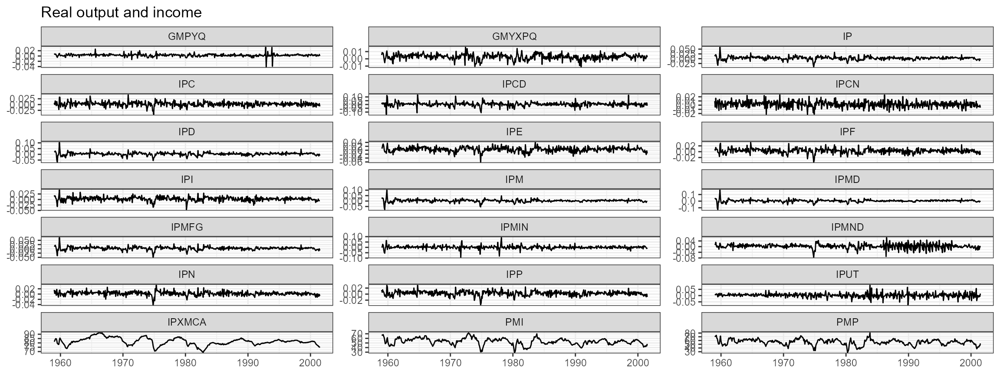

\
`bbe2005`` `[`%>%`](https://magrittr.tidyverse.org/reference/pipe.html)\
`  `[`select`](https://dplyr.tidyverse.org/reference/select.html)`(``Date``, ``24``:``49``)`` `[`%>%`](https://magrittr.tidyverse.org/reference/pipe.html)` `\
`  `[`gather`](https://tidyr.tidyverse.org/reference/gather.html)`(``type``, ``value``, ``-``Date``)`` `[`%>%`](https://magrittr.tidyverse.org/reference/pipe.html)` `\
`  `[`ggplot`](https://ggplot2.tidyverse.org/reference/ggplot.html)`(`[`aes`](https://ggplot2.tidyverse.org/reference/aes.html)`(``Date``, ``value``)``)`` ``+`\
`  `[`geom_line`](https://ggplot2.tidyverse.org/reference/geom_path.html)`(``)`` ``+`\
`  `[`facet_wrap`](https://ggplot2.tidyverse.org/reference/facet_wrap.html)`(``~``type``, ncol ``=`` ``3``, scales ``=`` ``"free_y"``)`` ``+`` `\
`  `[`ggtitle`](https://ggplot2.tidyverse.org/reference/labs.html)`(``"Employment and hours"``)`` ``+`\
`  `[`theme_bw`](https://ggplot2.tidyverse.org/reference/ggtheme.html)`(``)`` ``+`\
`    `[`theme`](https://ggplot2.tidyverse.org/reference/theme.html)`(`\
`      axis.title ``=`` `[`element_blank`](https://ggplot2.tidyverse.org/reference/element.html)`(``)`\
`    ``)`

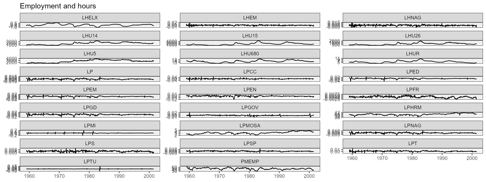

\
`bbe2005`` `[`%>%`](https://magrittr.tidyverse.org/reference/pipe.html)\
`  `[`select`](https://dplyr.tidyverse.org/reference/select.html)`(``Date``, ``50``:``54``)`` `[`%>%`](https://magrittr.tidyverse.org/reference/pipe.html)` `\
`  `[`gather`](https://tidyr.tidyverse.org/reference/gather.html)`(``type``, ``value``, ``-``Date``)`` `[`%>%`](https://magrittr.tidyverse.org/reference/pipe.html)` `\
`  `[`ggplot`](https://ggplot2.tidyverse.org/reference/ggplot.html)`(`[`aes`](https://ggplot2.tidyverse.org/reference/aes.html)`(``Date``, ``value``)``)`` ``+`\
`  `[`geom_line`](https://ggplot2.tidyverse.org/reference/geom_path.html)`(``)`` ``+`\
`  `[`facet_wrap`](https://ggplot2.tidyverse.org/reference/facet_wrap.html)`(``~``type``, ncol ``=`` ``3``, scales ``=`` ``"free_y"``)`` ``+`` `\
`  `[`ggtitle`](https://ggplot2.tidyverse.org/reference/labs.html)`(``"Consumption"``)`` ``+`\
`  `[`theme_bw`](https://ggplot2.tidyverse.org/reference/ggtheme.html)`(``)`` ``+`\
`  `[`theme`](https://ggplot2.tidyverse.org/reference/theme.html)`(`\
`    axis.title ``=`` `[`element_blank`](https://ggplot2.tidyverse.org/reference/element.html)`(``)`\
`  ``)`

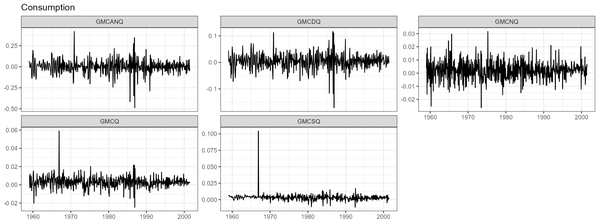

\
`bbe2005`` `[`%>%`](https://magrittr.tidyverse.org/reference/pipe.html)\
`  `[`select`](https://dplyr.tidyverse.org/reference/select.html)`(``Date``, ``55``:``61``)`` `[`%>%`](https://magrittr.tidyverse.org/reference/pipe.html)` `\
`  `[`gather`](https://tidyr.tidyverse.org/reference/gather.html)`(``type``, ``value``, ``-``Date``)`` `[`%>%`](https://magrittr.tidyverse.org/reference/pipe.html)` `\
`  `[`ggplot`](https://ggplot2.tidyverse.org/reference/ggplot.html)`(`[`aes`](https://ggplot2.tidyverse.org/reference/aes.html)`(``Date``, ``value``)``)`` ``+`\
`  `[`geom_line`](https://ggplot2.tidyverse.org/reference/geom_path.html)`(``)`` ``+`\
`  `[`facet_wrap`](https://ggplot2.tidyverse.org/reference/facet_wrap.html)`(``~``type``, ncol ``=`` ``3``, scales ``=`` ``"free_y"``)`` ``+`` `\
`  `[`ggtitle`](https://ggplot2.tidyverse.org/reference/labs.html)`(``"Housing starts "``)`` ``+`\
`  `[`theme_bw`](https://ggplot2.tidyverse.org/reference/ggtheme.html)`(``)`` ``+`\
`  `[`theme`](https://ggplot2.tidyverse.org/reference/theme.html)`(`\
`    axis.title ``=`` `[`element_blank`](https://ggplot2.tidyverse.org/reference/element.html)`(``)`\
`  ``)`

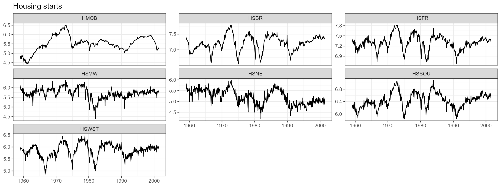

\
`bbe2005`` `[`%>%`](https://magrittr.tidyverse.org/reference/pipe.html)\
`  `[`select`](https://dplyr.tidyverse.org/reference/select.html)`(``Date``, ``62``:``66``)`` `[`%>%`](https://magrittr.tidyverse.org/reference/pipe.html)` `\
`  `[`gather`](https://tidyr.tidyverse.org/reference/gather.html)`(``type``, ``value``, ``-``Date``)`` `[`%>%`](https://magrittr.tidyverse.org/reference/pipe.html)` `\
`  `[`ggplot`](https://ggplot2.tidyverse.org/reference/ggplot.html)`(`[`aes`](https://ggplot2.tidyverse.org/reference/aes.html)`(``Date``, ``value``)``)`` ``+`\
`  `[`geom_line`](https://ggplot2.tidyverse.org/reference/geom_path.html)`(``)`` ``+`\
`  `[`facet_wrap`](https://ggplot2.tidyverse.org/reference/facet_wrap.html)`(``~``type``, ncol ``=`` ``3``, scales ``=`` ``"free_y"``)`` ``+`` `\
`  `[`ggtitle`](https://ggplot2.tidyverse.org/reference/labs.html)`(``"Real inventories, orders, and unfilled orders"``)`` ``+`\
`  `[`theme_bw`](https://ggplot2.tidyverse.org/reference/ggtheme.html)`(``)`` ``+`\
`  `[`theme`](https://ggplot2.tidyverse.org/reference/theme.html)`(`\
`    axis.title ``=`` `[`element_blank`](https://ggplot2.tidyverse.org/reference/element.html)`(``)`\
`  ``)`

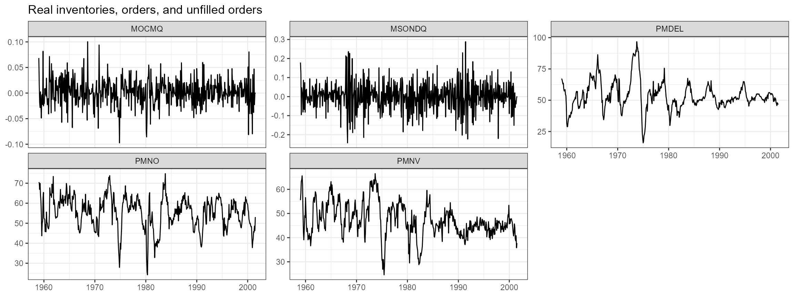

\
`bbe2005`` `[`%>%`](https://magrittr.tidyverse.org/reference/pipe.html)\
`  `[`select`](https://dplyr.tidyverse.org/reference/select.html)`(``Date``, ``67``:``73``)`` `[`%>%`](https://magrittr.tidyverse.org/reference/pipe.html)` `\
`  `[`gather`](https://tidyr.tidyverse.org/reference/gather.html)`(``type``, ``value``, ``-``Date``)`` `[`%>%`](https://magrittr.tidyverse.org/reference/pipe.html)` `\
`  `[`ggplot`](https://ggplot2.tidyverse.org/reference/ggplot.html)`(`[`aes`](https://ggplot2.tidyverse.org/reference/aes.html)`(``Date``, ``value``)``)`` ``+`\
`  `[`geom_line`](https://ggplot2.tidyverse.org/reference/geom_path.html)`(``)`` ``+`\
`  `[`facet_wrap`](https://ggplot2.tidyverse.org/reference/facet_wrap.html)`(``~``type``, ncol ``=`` ``3``, scales ``=`` ``"free_y"``)`` ``+`` `\
`  `[`ggtitle`](https://ggplot2.tidyverse.org/reference/labs.html)`(``"Stock prices"``)`` ``+`\
`  `[`theme_bw`](https://ggplot2.tidyverse.org/reference/ggtheme.html)`(``)`` ``+`\
`  `[`theme`](https://ggplot2.tidyverse.org/reference/theme.html)`(`\
`    axis.title ``=`` `[`element_blank`](https://ggplot2.tidyverse.org/reference/element.html)`(``)`\
`  ``)`

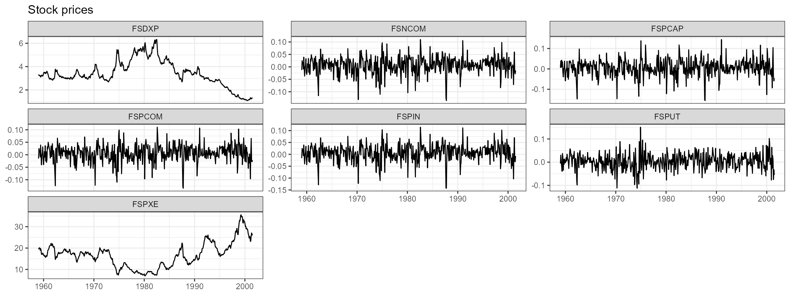

\
`bbe2005`` `[`%>%`](https://magrittr.tidyverse.org/reference/pipe.html)\
`  `[`select`](https://dplyr.tidyverse.org/reference/select.html)`(``Date``, ``74``:``77``)`` `[`%>%`](https://magrittr.tidyverse.org/reference/pipe.html)` `\
`  `[`gather`](https://tidyr.tidyverse.org/reference/gather.html)`(``type``, ``value``, ``-``Date``)`` `[`%>%`](https://magrittr.tidyverse.org/reference/pipe.html)` `\
`  `[`ggplot`](https://ggplot2.tidyverse.org/reference/ggplot.html)`(`[`aes`](https://ggplot2.tidyverse.org/reference/aes.html)`(``Date``, ``value``)``)`` ``+`\
`  `[`geom_line`](https://ggplot2.tidyverse.org/reference/geom_path.html)`(``)`` ``+`\
`  `[`facet_wrap`](https://ggplot2.tidyverse.org/reference/facet_wrap.html)`(``~``type``, ncol ``=`` ``3``, scales ``=`` ``"free_y"``)`` ``+`` `\
`  `[`ggtitle`](https://ggplot2.tidyverse.org/reference/labs.html)`(``"Exchange rates"``)`` ``+`\
`  `[`theme_bw`](https://ggplot2.tidyverse.org/reference/ggtheme.html)`(``)`` ``+`\
`  `[`theme`](https://ggplot2.tidyverse.org/reference/theme.html)`(`\
`    axis.title ``=`` `[`element_blank`](https://ggplot2.tidyverse.org/reference/element.html)`(``)`\
`  ``)`

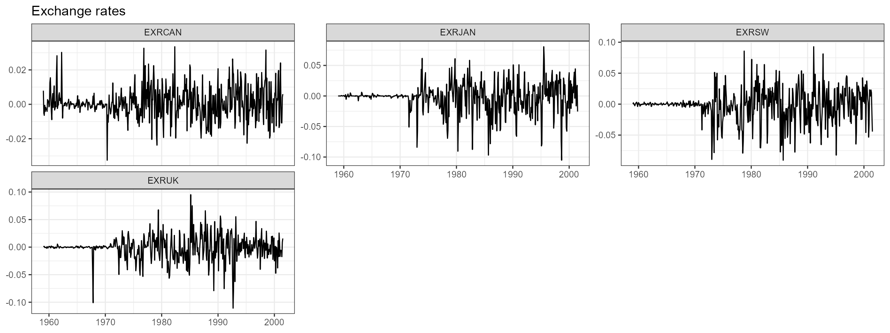

\
`bbe2005`` `[`%>%`](https://magrittr.tidyverse.org/reference/pipe.html)\
`  `[`select`](https://dplyr.tidyverse.org/reference/select.html)`(``Date``, ``78``:``92``)`` `[`%>%`](https://magrittr.tidyverse.org/reference/pipe.html)` `\
`  `[`gather`](https://tidyr.tidyverse.org/reference/gather.html)`(``type``, ``value``, ``-``Date``)`` `[`%>%`](https://magrittr.tidyverse.org/reference/pipe.html)` `\
`  `[`ggplot`](https://ggplot2.tidyverse.org/reference/ggplot.html)`(`[`aes`](https://ggplot2.tidyverse.org/reference/aes.html)`(``Date``, ``value``)``)`` ``+`\
`  `[`geom_line`](https://ggplot2.tidyverse.org/reference/geom_path.html)`(``)`` ``+`\
`  `[`facet_wrap`](https://ggplot2.tidyverse.org/reference/facet_wrap.html)`(``~``type``, ncol ``=`` ``3``, scales ``=`` ``"free_y"``)`` ``+`` `\
`  `[`ggtitle`](https://ggplot2.tidyverse.org/reference/labs.html)`(``"Interest rates"``)`` ``+`\
`  `[`theme_bw`](https://ggplot2.tidyverse.org/reference/ggtheme.html)`(``)`` ``+`\
`  `[`theme`](https://ggplot2.tidyverse.org/reference/theme.html)`(`\
`    axis.title ``=`` `[`element_blank`](https://ggplot2.tidyverse.org/reference/element.html)`(``)`\
`  ``)`

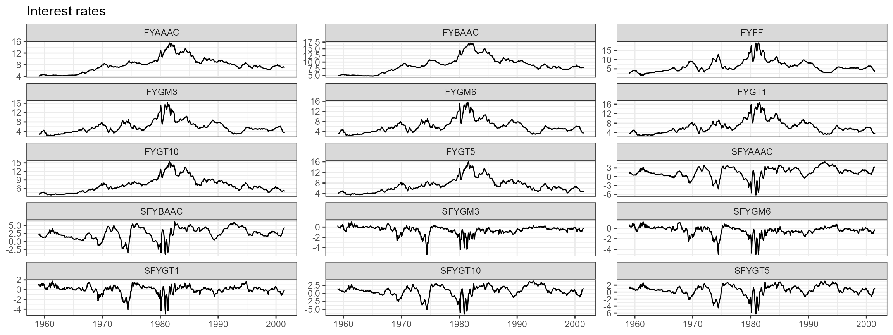

\
`bbe2005`` `[`%>%`](https://magrittr.tidyverse.org/reference/pipe.html)\
`  `[`select`](https://dplyr.tidyverse.org/reference/select.html)`(``Date``, ``93``:``102``)`` `[`%>%`](https://magrittr.tidyverse.org/reference/pipe.html)` `\
`  `[`gather`](https://tidyr.tidyverse.org/reference/gather.html)`(``type``, ``value``, ``-``Date``)`` `[`%>%`](https://magrittr.tidyverse.org/reference/pipe.html)` `\
`  `[`ggplot`](https://ggplot2.tidyverse.org/reference/ggplot.html)`(`[`aes`](https://ggplot2.tidyverse.org/reference/aes.html)`(``Date``, ``value``)``)`` ``+`\
`  `[`geom_line`](https://ggplot2.tidyverse.org/reference/geom_path.html)`(``)`` ``+`\
`  `[`facet_wrap`](https://ggplot2.tidyverse.org/reference/facet_wrap.html)`(``~``type``, ncol ``=`` ``3``, scales ``=`` ``"free_y"``)`` ``+`` `\
`  `[`ggtitle`](https://ggplot2.tidyverse.org/reference/labs.html)`(``"Money and credit quantity aggregates"``)`` ``+`\
`  `[`theme_bw`](https://ggplot2.tidyverse.org/reference/ggtheme.html)`(``)`` ``+`\
`  `[`theme`](https://ggplot2.tidyverse.org/reference/theme.html)`(`\
`    axis.title ``=`` `[`element_blank`](https://ggplot2.tidyverse.org/reference/element.html)`(``)`\
`  ``)`

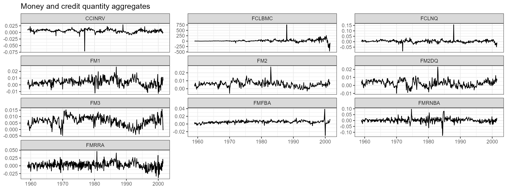

\
`bbe2005`` `[`%>%`](https://magrittr.tidyverse.org/reference/pipe.html)\
`  `[`select`](https://dplyr.tidyverse.org/reference/select.html)`(``Date``, ``103``:``118``)`` `[`%>%`](https://magrittr.tidyverse.org/reference/pipe.html)` `\
`  `[`gather`](https://tidyr.tidyverse.org/reference/gather.html)`(``type``, ``value``, ``-``Date``)`` `[`%>%`](https://magrittr.tidyverse.org/reference/pipe.html)` `\
`  `[`ggplot`](https://ggplot2.tidyverse.org/reference/ggplot.html)`(`[`aes`](https://ggplot2.tidyverse.org/reference/aes.html)`(``Date``, ``value``)``)`` ``+`\
`  `[`geom_line`](https://ggplot2.tidyverse.org/reference/geom_path.html)`(``)`` ``+`\
`  `[`facet_wrap`](https://ggplot2.tidyverse.org/reference/facet_wrap.html)`(``~``type``, ncol ``=`` ``3``, scales ``=`` ``"free_y"``)`` ``+`` `\
`  `[`ggtitle`](https://ggplot2.tidyverse.org/reference/labs.html)`(``"Price indexes"``)`` ``+`\
`  `[`theme_bw`](https://ggplot2.tidyverse.org/reference/ggtheme.html)`(``)`` ``+`\
`  `[`theme`](https://ggplot2.tidyverse.org/reference/theme.html)`(`\
`    axis.title ``=`` `[`element_blank`](https://ggplot2.tidyverse.org/reference/element.html)`(``)`\
`  ``)`

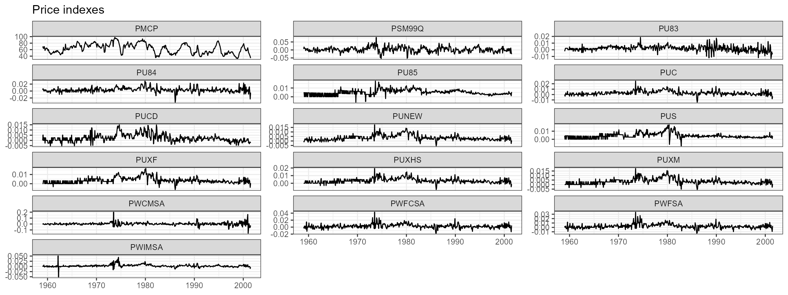

\
`bbe2005`` `[`%>%`](https://magrittr.tidyverse.org/reference/pipe.html)\
`  `[`select`](https://dplyr.tidyverse.org/reference/select.html)`(``Date``, ``119``:``120``)`` `[`%>%`](https://magrittr.tidyverse.org/reference/pipe.html)` `\
`  `[`gather`](https://tidyr.tidyverse.org/reference/gather.html)`(``type``, ``value``, ``-``Date``)`` `[`%>%`](https://magrittr.tidyverse.org/reference/pipe.html)` `\
`  `[`ggplot`](https://ggplot2.tidyverse.org/reference/ggplot.html)`(`[`aes`](https://ggplot2.tidyverse.org/reference/aes.html)`(``Date``, ``value``)``)`` ``+`\
`  `[`geom_line`](https://ggplot2.tidyverse.org/reference/geom_path.html)`(``)`` ``+`\
`  `[`facet_wrap`](https://ggplot2.tidyverse.org/reference/facet_wrap.html)`(``~``type``, ncol ``=`` ``3``, scales ``=`` ``"free_y"``)`` ``+`` `\
`  `[`ggtitle`](https://ggplot2.tidyverse.org/reference/labs.html)`(``"Average hourly earnings "``)`` ``+`\
`  `[`theme_bw`](https://ggplot2.tidyverse.org/reference/ggtheme.html)`(``)`` ``+`\
`  `[`theme`](https://ggplot2.tidyverse.org/reference/theme.html)`(`\
`    axis.title ``=`` `[`element_blank`](https://ggplot2.tidyverse.org/reference/element.html)`(``)`\
`  ``)`

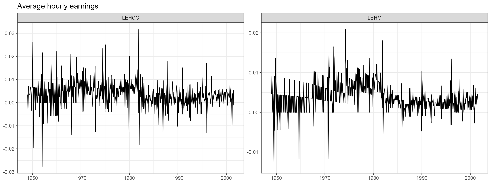

\
`bbe2005`` `[`%>%`](https://magrittr.tidyverse.org/reference/pipe.html)\
`  `[`select`](https://dplyr.tidyverse.org/reference/select.html)`(``Date``, ``121``)`` `[`%>%`](https://magrittr.tidyverse.org/reference/pipe.html)` `\
`  `[`gather`](https://tidyr.tidyverse.org/reference/gather.html)`(``type``, ``value``, ``-``Date``)`` `[`%>%`](https://magrittr.tidyverse.org/reference/pipe.html)` `\
`  `[`ggplot`](https://ggplot2.tidyverse.org/reference/ggplot.html)`(`[`aes`](https://ggplot2.tidyverse.org/reference/aes.html)`(``Date``, ``value``)``)`` ``+`\
`  `[`geom_line`](https://ggplot2.tidyverse.org/reference/geom_path.html)`(``)`` ``+`\
`  `[`facet_wrap`](https://ggplot2.tidyverse.org/reference/facet_wrap.html)`(``~``type``, ncol ``=`` ``3``, scales ``=`` ``"free_y"``)`` ``+`` `\
`  `[`ggtitle`](https://ggplot2.tidyverse.org/reference/labs.html)`(``"Miscellaneous "``)`` ``+`\
`  `[`theme_bw`](https://ggplot2.tidyverse.org/reference/ggtheme.html)`(``)`` ``+`\
`  `[`theme`](https://ggplot2.tidyverse.org/reference/theme.html)`(`\
`    axis.title ``=`` `[`element_blank`](https://ggplot2.tidyverse.org/reference/element.html)`(``)`\
`  ``)`

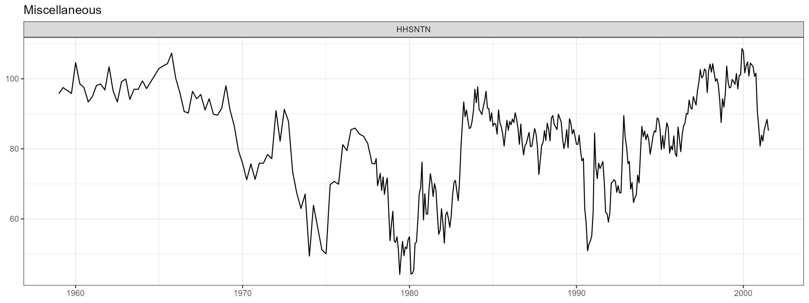
