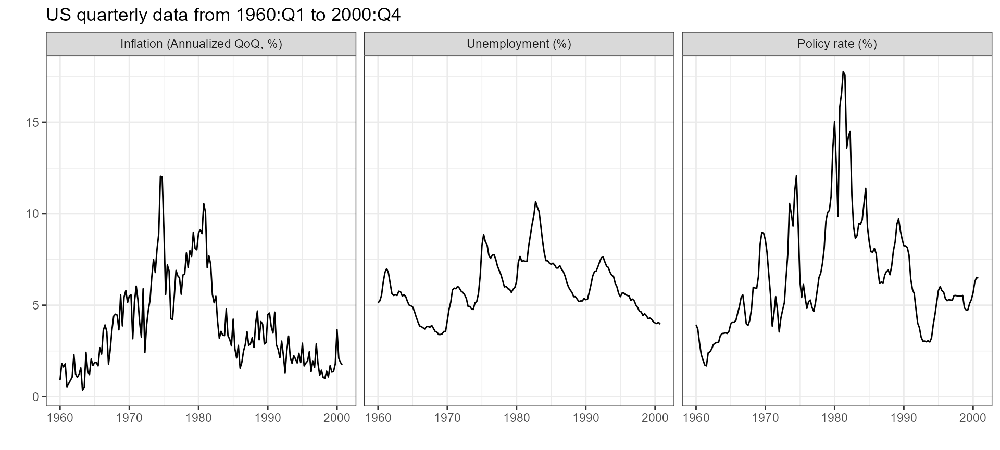

# Stock and Watson (2001)

\
[`library`](https://rdrr.io/r/base/library.html)`(`[`econdata`](https://github.com/kvasilopoulos/econdata)`)`\
[`library`](https://rdrr.io/r/base/library.html)`(`[`ggplot2`](https://ggplot2.tidyverse.org)`)`\
[`library`](https://rdrr.io/r/base/library.html)`(`[`tidyr`](https://tidyr.tidyverse.org)`)`

\
\
`fc_labels`` ``<-`\
`  `[`c`](https://rdrr.io/r/base/c.html)`(`\
`    ``"infl"`` ``=`` ``"Inflation (Annualized QoQ, %)"``,`\
`    ``"un"`` ``=`` ``"Unemployment (%)"``,`\
`    ``"ff"`` ``=`` ``"Policy rate (%)"`\
`  ``)`\
\
[`gather`](https://tidyr.tidyverse.org/reference/gather.html)`(``sw2001``, ``variable``, ``value``, ``-``date``, factor_key ``=`` ``TRUE``)`` `[`%>%`](https://magrittr.tidyverse.org/reference/pipe.html)` `\
`  `[`ggplot`](https://ggplot2.tidyverse.org/reference/ggplot.html)`(`[`aes`](https://ggplot2.tidyverse.org/reference/aes.html)`(``date``, ``value``)``)`` ``+`` `\
`  `[`geom_line`](https://ggplot2.tidyverse.org/reference/geom_path.html)`(``)`` ``+`` `\
`  `[`facet_wrap`](https://ggplot2.tidyverse.org/reference/facet_wrap.html)`(`` ``~`` ``variable``, labeller ``=`` `[`labeller`](https://ggplot2.tidyverse.org/reference/labeller.html)`(``variable ``=`` `[`as_labeller`](https://ggplot2.tidyverse.org/reference/as_labeller.html)`(``fc_labels``)``)``)`` ``+`` `\
`  `[`theme_bw`](https://ggplot2.tidyverse.org/reference/ggtheme.html)`(``)`` ``+`` `\
`  `[`labs`](https://ggplot2.tidyverse.org/reference/labs.html)`(``x ``=`` ``""``, y ``=`` ``""``, `\
`       ``# title = "Stock & Watson (2001). 'Vector Autoregressions'",`\
`       ``# subtitle = " Journal of Economic Perspectives",`\
`       title ``=`` ``"US quarterly data from 1960:Q1 to 2000:Q4"``)`

